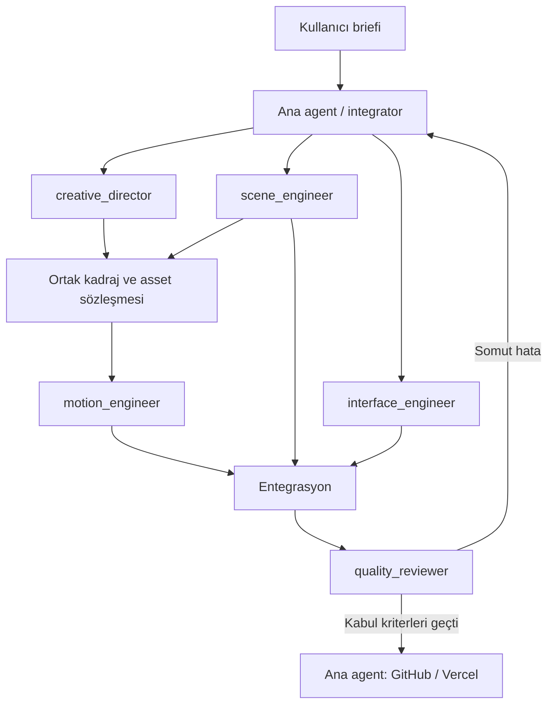

# Agent mimarisi

Bu yapı geliştirme işini bölmek içindir; web sitesinde çalışan bir AI/backend sistemi değildir. Agent API anahtarı, chatbot veya ziyaretçi verisi işleme gerektirmez.

## Roller ve sahiplik

| Rol | Sorumluluk | Varsayılan yazma alanı | Teslim |
| --- | --- | --- | --- |
| Ana agent / integrator | Ürün kapsamı, ortak sözleşme, entegrasyon, GitHub, Vercel | app girişleri, shared types, chapters, tokenlar, paketler, CI, durum belgeleri | Çalışan bütün ve doğrulama |
| creative_director | Art direction ve asset briefi | Atanan tasarım belgeleri | Kadraj, malzeme, metin, asset şartları |
| scene_engineer | Uçak, kabin, bulut, kamera rig'i | `components/scene`, `lib/scene`, atanan public assetler | Sahne ve GPU/asset ölçümü |
| motion_engineer | Progress → poz, GSAP timeline | `lib/motion` (chapters hariç), ilgili testler | Tersine çalışabilen koreografi |
| interface_engineer | Bölümler, navigasyon, hotspot ve mobil UI | `components/story`, `components/ui`, component CSS | Semantik erişilebilir arayüz |
| quality_reviewer | Bağımsız davranış ve performans kontrolü | Atanan QA raporu/testleri | Tekrarlanabilir bulgular |

Beş uzman tanımlıdır; aynı anda hepsi çalıştırılmaz. Konfigürasyon en çok **3 alt agent** açılmasına izin verir; ana agentla birlikte toplam 4 aktif çalışma hedeflenir. Gerçek oturum kapasitesi daha düşükse işler sıraya alınır.



## Proje içi dosyalar

`AGENTS.md` genel çalışma sözleşmesi. `.codex/config.toml` paralellik sınırı. `.codex/agents/*.toml` her rolün adı, açıklaması ve developer_instructions alanını içerir. Model ve reasoning sabitlenmedi; ana oturum ayarları devralınır. Global kullanıcı config'i değiştirilmez.

Bu dosyaların eklenmesi çalışan agent oturumları başlatmaz. Destekleyen bir Codex sürümünde proje bu klasörden açıldığında rol tanımları kullanılabilir. Eski bir istemci özel rolleri yüklemiyorsa aynı görev metni araçtaki subagent talimatı olarak aktarılır; rollerin gerçekten yüklendiği iddia edilmez.

Resmi şema: [OpenAI custom subagents](https://learn.chatgpt.com/docs/agent-configuration/subagents). Güncel sayfa proje rol dosyalarını `.codex/agents/` altında tanımlar. Config dosyaları TOML olarak doğrulanır; canlı dispatch doğrulaması ayrıca durum kaydında belirtilir.

## Yürütme dalgaları

1. **Sözleşme:** Ana agent chapter aralıklarını ve scene tiplerini belirler. Creative tasarım briefi, Scene asset teknik kontrolü yapar. Interface temel içerikte çalışabilir.
2. **İlk kesit:** Scene tek canvas/jet; Motion mock FlightState üzerinde saf poz örnekleyici; Interface semantik bölümler. Her birinin dosyası ayrıdır.
3. **Entegrasyon:** Ana agent boundary ve ref bağlantısını yapar. Motion gerçek sahneye bağlanır. Scene/Interface yalnızca kendilerine geri verilen hataları düzeltir.
4. **Kalite:** Quality tamamlanmış akışı inceler. Bulgular sahiplerine döner; ana agent aynı kabul koşulunu tekrar doğrular.
5. **Yayın:** Ana agent CI, Vercel preview, final kontrol ve production işlemlerini yürütür. Uzmanlar birbirinden bağımsız yayın çıkarmaz.

## İş paketi şablonu

```text
Görev: VEL-04 / Hero ve bulut teknik kesiti
Rol: scene_engineer
Girdi: docs/ASSETS.md, src/types/scene.ts, kabul edilmiş GLB
Yazılabilir yollar: src/components/scene/**, src/lib/scene/**
Beklenen çıktı: tek canvas içinde top-down jet ve derinlikli bulutlar
Bağımlılık: VEL-02 model node/eksen kontrolü geçti
Kabul: 0–.34 arası atlama/ters scroll, model hatasında okunabilir fallback
Doğrulama: build, ilgili sahne kanıtı, asset boyutu ve draw call raporu
Teslim: değişen dosyalar, doğrulananlar, açık sınırlamalar, sözleşme önerileri
```

## Çakışma ve entegrasyon protokolü

Görevlendirmede dosya sahipliği açıkça yazılır. Ortak bir dosyada ihtiyaç çıkarsa uzman ana agente değişiklik önerisini gönderir. İki agent aynı dosyaya atanmışsa yeni yazma durdurulur, sahiplik tekleştirilir; başkasının değişikliği reset edilmez.

Aynı checkout'ta branch değiştirilmez. Dal bazlı izolasyon gerekiyorsa iş için ayrı git worktree açılır. Ana agent değişiklikleri diff üzerinden gözden geçirir, dar testleri ve ortak kontrolleri çalıştırır, sonra entegre eder. Görev dal adları `feat/vel-04-hero-clouds` gibi task ID içerir; ihtiyaç oluşmadan boş dallar oluşturulmaz.

Quality, kaynağı değiştirmeden bulgu üretir; düzeltme rol sahibine döner. Modelin lisans durumu, eksik asset, test edilemeyen cihaz veya başarısız build somut sınırlama olarak raporlanır. “Tamamlandı” yalnızca kabul koşulu sağlandığında kullanılır.

## Sonraki geliştirme için hazır talimat

> VEL-01 ve VEL-02 ile Faz 1'i başlat. creative_director'a yalnızca görsel yön ve asset briefini, scene_engineer'a dış gövde/kabin cutaway teknik provasını delege et. Ana agent olarak ortak koordinat ve node sözleşmesini yönet. Model sağlanmamışsa satın alma yapmadan uygun kaynakları araştır ve blockout sınırını açıkça belirt. İki çıktıyı birleştirip kabul kriterlerini doğrula, STATUS ve BACKLOG'u güncelle.
