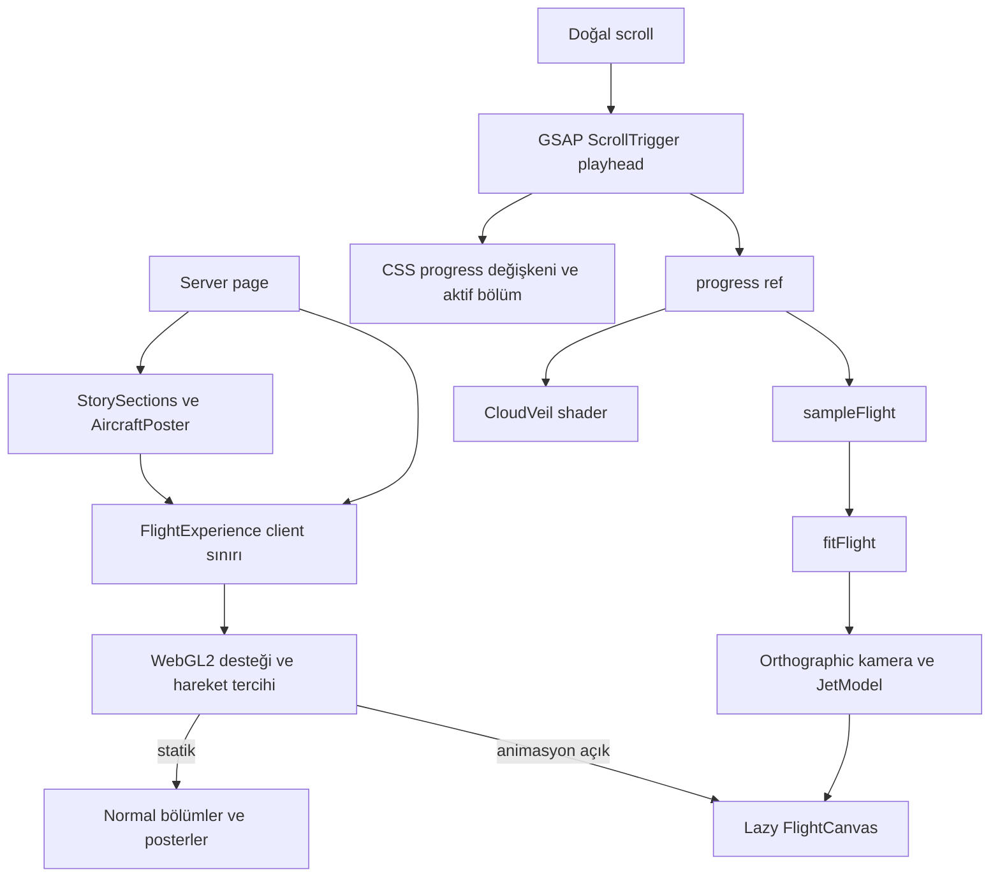

# Teknik mimari

Durum: 13 Eylül 2026 demo uygulaması. Bu belge mevcut `src/` kodunu tarif eder; ilk plandaki GLB/LOD ve kalite profili önerilerini uygulanmış özellik olarak sunmaz. Yayın ve doğrulama sonuçlarının kaynağı [STATUS.md](STATUS.md), sonraki üretim hedeflerinin kaynağı [PLAN.md](PLAN.md)'dir.

## Mevcut yapı

```text
src/
  app/
    page.tsx                   # Server page; deneyim ve içerik bileşimi
    layout.tsx                 # Server layout ve metadata
    globals.css                # Sabit sahne, sticky bölümler, responsive/statik düzen
  components/
    experience/
      FlightExperience.tsx     # Yetenek/tercih, hata sınırı, tek playhead, navigasyon
    scene/
      FlightCanvas.tsx         # Tek R3F canvas, SceneController, CloudVeil
      JetModel.tsx             # Aynı jetin dışı, ayrılan üst kabuğu ve kabini
    story/
      StorySections.tsx        # Altı semantik bölüm; server component
      AircraftPoster.tsx       # Desktop/mobil hero, kabin ve yan görünüm posterleri
      CabinDetails.tsx         # Üç erişilebilir kabin seçeneği; client component
  lib/
    motion/
      chapters.ts              # Bölüm ID'leri ve progress aralıkları
      sample-flight.ts         # Saf FlightPose örneklemesi
      fit-flight.ts            # Viewport'a göre zoom ve mobil konum düzeltmesi
    scene/
      jet-geometry.ts          # Parametrik, birleştirilmiş uçak geometrisi
  styles/tokens.css            # Tasarım tokenları
  types/scene.ts               # İlk planın FlightState/QualityTier/node sözleşmeleri
public/images/                 # Bulut atmosferi ve sahneden alınan uçak posterleri
tests/                         # Bölüm, poz ve mobil kadraj sınır testleri
```

Ayrı `ExperienceBoundary`, `StaticJourney`, `CameraRig` veya `CloudField` dosyaları yoktur. Bu sorumluluklar mevcut deneyim, sahne ve içerik bileşenlerinde karşılanır.

## Veri akışı ve client sınırı



`page.tsx`, `layout.tsx` ve anlatı metinlerini taşıyan `StorySections` server component olarak kalır. Server içerik `FlightExperience` bileşenine `children` olarak verilir. `dynamic(..., { ssr: false })` yalnızca bu client sınırında kullanılır; Three.js sahnesi burada ayrı yüklenir. Kabin butonları küçük bir client bileşenidir.

GSAP bir nesnenin `value` alanını `0 → 1` hareket ettirir. Progress ref'i, render isteği, atmosferin CSS değişkeni ve ilerleme çizgisi bu playhead'den beslenir. React'teki aktif bölüm yalnızca chapter değiştiğinde güncellenir. Kamera ve model pozu için kare başına React state kullanılmaz.

## Runtime sözleşmeleri

[`chapters.ts`](../src/lib/motion/chapters.ts) altı anchor ID'sini ve normalize aralıklarını tanımlar. Aralıklar `[start, end)` biçimindedir; son aralık `1` değerini kapsar. `getChapterAt` overscroll'u sınırlar, NaN'i başlangıca düşürür. CSS bölüm yüksekliklerinin oranları bu aralıklarla eşleşir; iki yer birlikte güncellenmelidir.

[`sampleFlight`](../src/lib/motion/sample-flight.ts) şu `FlightPose` alanlarını döndürür:

| Alan | Runtime anlamı |
| --- | --- |
| `jetPosition` | Dünya konumu `[x, y, z]` |
| `jetRotation` | Radyan cinsinden Euler XYZ açıları |
| `cameraPosition`, `cameraTarget` | Orthographic kameranın konumu ve bakış hedefi |
| `zoom` | 900 CSS piksel viewport yüksekliği için temel zoom |
| `reveal` | Üst kabuk açılımı: kapalı `0`, açık `1` |
| `cloud` | Örneklenen normalize bulut zarfı; demo CloudVeil bunu kullanmaz |

Sampler geçmiş karelerden bağımsızdır. Keyframe'ler arasında pozlar, açılar ve skalerler `t²(3−2t)` smoothstep ağırlığıyla hesaplanır. Açı dizisinde sarma sıçraması yoktur; sahne `rotation.set` ile Euler açılarını uygular. Quaternion slerp veya Catmull-Rom yolu bu demoda kullanılmaz.

[`fitFlight`](../src/lib/motion/fit-flight.ts) zoom'u `height / 900` ile ölçekler. Genişlik `760px` altındaysa erken bölümde kanatların kadraja sığması için zoom'u sınırlar; kabine yaklaşırken sınırı yumuşakça değiştirir ve modeli Z doğrultusunda metnin altına taşır. Yan uçuşa geçişte bu ek düzeltmeler `.60–.76` boyunca sonlanır. Kaynak poz mutasyona uğramaz.

Koordinatlar Y yukarı, burun yerel `−Z`, kanatlar X doğrultusudur. Jet yaklaşık 14 birim uzunluk ve açıklığa sahip bir konsept modeldir; bunlar gerçek bir hava aracına ait teknik özellik iddiası değildir. Plan görünümünde kameranın Z bileşeni `.01` olarak korunur; bakış yönünün dünya up ekseniyle tam çakışması önlenir.

`src/types/scene.ts` içindeki `FlightState` ve `QualityTier` ilk plan sözleşmeleri olarak durur. Mevcut render akışı `FlightPose` ve ayrı progress/reveal ref'leriyle çalışır; `full/lite/static` enum'u runtime kalite seçicisine bağlı değildir.

## Geometri, materyal ve atmosfer

Uçak dışarıdan indirilen GLB yerine [`createJetGeometries`](../src/lib/scene/jet-geometry.ts) ile tarayıcıda üretilir. Gövde, kanatlar, T kuyruk, motorlar, camlar, oturma alanı, masa ve özel dinlenme alanı parametrik geometridir. Parçalar ad/materyal grubuna göre `mergeGeometries` ile birleştirilir; ayrı koltuk instancing sistemi yoktur.

`JetModel` aynı `JetRoot` altında dış gövdeyi, `FuselageUpper` grubunu ve `CabinInterior` grubunu tutar. `reveal` arttıkça üst kabuk hafif yana/yukarı taşınır, küçük bir açıyla ayrılır ve opaklığı azalır. Tam açılımda üst grup gizlenir; kabin aynı alt gövde içinde görünür kalır. Kapanış aynı işlemin tersidir. İkinci bir uçak veya bağımsız iç mekân modeline geçilmez.

Materyaller kurulumda oluşturulur. Ahşap çizgileri dahil yüzey detaylarının çoğu geometridir; uçak için harici doku indirilmez. Yansıma ortamı `RoomEnvironment` ve `PMREMGenerator` ile üretilir. Dış HDR dosyası ve post-processing zinciri yoktur. Geometri, materyaller ve ortam render target'ı unmount sırasında dispose edilir.

Atmosfer iki parçadır: DOM'daki `cloud-atmosphere.png` küçük bir CSS kayma/ölçek değişimi alır; kameraya dönük tek shader düzlemi `.15–.41` aralığında uçağın önünden geçen bulut örtüsünü verir. Shader kendi sinüs-kare opacity zarfını ve noise desenini progress'ten hesaplar. Sampler'ın `cloud` alanı bu aşamada yalnızca sözleşmede durur. Üç ayrı derinlik katmanı veya hacimsel bulut simülasyonu uygulanmamıştır.

## Render ve kaynak yaşam döngüsü

Tek `Canvas`, orthographic kamera ve `frameloop="demand"` kullanılır. DPR aralığı `1–1.5` ile sınırlıdır. Scroll güncellemesi `invalidate()` çağırır; sürekli boşta uçak salınımı veya ikinci animasyon saati yoktur. `SceneController` kamera/jet pozunu `useFrame(..., -2)`, `JetModel` kabuğu `useFrame(..., -1)` içinde uygular. Ölçüler R3F `size` verisinden gelir; 3D render callback'lerinde DOM layout ölçülmez.

Belge gizliyken scroll kaynaklı render isteği gönderilmez; görünür olduğunda sahne invalidate edilir. `webglcontextlost` statik moda geçirir. `SceneBoundary` React sahne hatasını kaydeder ve aynı fallback'i etkinleştirir. GSAP kurulumu `useGSAP` context'ine bağlıdır; `revertOnUpdate` mod değişiminde kaynakları kaldırır. Fontlar hazır olduğunda ve kurulumdan kısa süre sonra ScrollTrigger ölçümleri yenilenir. `FlightExperience`, `fromTo` ile başlangıç değerini açıkça sıfırlar; `onRefresh` ve kurulum refresh'i mevcut scroll progress'ini `applyProgress` yoluyla ref, DOM ve navigasyona uygular. Böylece refresh sırasında tween callback'inin bastırılması ortadan yüklenen sahneyi başlangıç pozunda bırakmaz.

## Statik deneyim ve etkileşim

İlk HTML normal bölüm akışı ve poster markup'ıyla gelir. Client mount, WebGL2 desteği ve hareket tercihi okunduktan sonra uygun koşulda canvas yüklenir. Canvas kurulumunu izleyen animation frame callback'i `scene-ready` durumunu açar; hero posteri gizlenir ve canvas CSS opacity geçişiyle görünür. Bu callback görsel kalite ölçümü değildir; yükleme/poster hizalaması tarayıcı QA'sında kontrol edilir.

OS'nin azaltılmış hareket tercihi varsayılan olarak izlenir. Kullanıcı düğmeyle animasyonu açıp kapatabilir. Statik modda canvas unmount edilir, scrub durur, sticky içerikler normal dikey bölümlere dönüşür ve `AircraftPoster` hero/kabin/yan görünüm resimlerini seçer. WebGL2 kullanılamadığında veya sahne hata verdiğinde aynı okunabilir akış kullanılır. Ayrı `StaticJourney` bileşeni ve model indirme zaman aşımı yoktur.

Mod değişirken o anda görülen chapter saklanır ve yeni düzende aynı bölümün başlangıcına hizalanır; tam piksel konumu korunmaz. Statik navigasyon, scroll/resize olaylarında `requestAnimationFrame` ile sınırlandırılmış DOM ölçümü yapar. `CabinDetails` üç gerçek buton, `aria-pressed`, ortak açıklama alanı ve seçim değişiminde `aria-live="polite"` kullanır. Bunlar 3D yüzeye projekte edilmiş hotspotlar değildir.

## DOM katmanları ve yatay uçuş

`scene-shell` viewport'a sabitlenir, `z-index: 0` taşır ve pointer olaylarını almaz. Anlatı `z-index: 10`, navigasyon/hareket kontrolü `30`, skip link `60` katmanındadır. Deneyim kökü kendi stacking context'ini oluşturur. Bölümlerin içeriği CSS sticky ile tutulur; GSAP pin kullanılmaz.

Horizon bölümündeki opak `flyby-card`, animasyon modunda viewport ortasında sabit durur. Jet `.76–.90` aralığında soldan sağa ilerlerken canvas üzerindeki DOM panel tarafından doğal olarak örtülür. Canvas z-index'i değiştirilmez. Mobilde kart aşağıda, uçuş yolu yukarıda konumlanır. Statik modda yan görünüm posteri ve panel normal akıştadır.

## Üretim cilası ve yayın sınırı

Demo aynı parametrik modeli tüm animasyonlu cihazlarda kullanır. GLB export/edinim, gerçek LOD, performansa göre adaptif kalite, ticari model lisansı değerlendirmesi ve ölçülmüş cihaz bütçeleri sonraki çalışma konularıdır. İlk plandaki performans sayıları ölçülmüş demo sonucu sayılmaz. Gerçek iOS/Android, context loss, tercih değişimi, deep reload ve yayın URL'si kontrollerinin sonuçları çalıştırıldıktan sonra `STATUS.md` içine kaydedilir.

Next.js App Router ve Vercel Next.js preset hedefi korunur. Backend, API route, rezervasyon formu veya gizli API anahtarı yoktur. Paket sürümlerinin kaynağı `package.json` ve kilit dosyasıdır. Vercel bağlantısı, deploy durumu ve gerçek URL [DEPLOYMENT.md](DEPLOYMENT.md) ve durum kaydında takip edilir.
