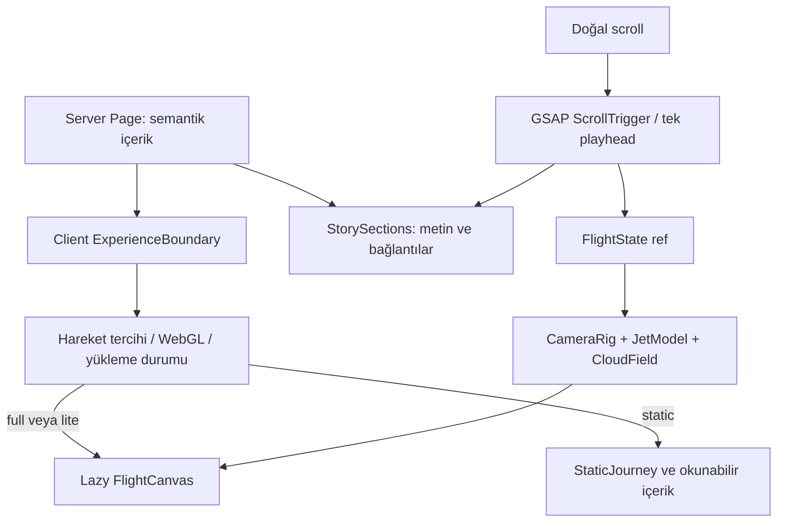

# Teknik mimari

## Mevcut ve hedef yapı

Faz 0'da `src/app/`, `src/styles/tokens.css`, `src/lib/motion/chapters.ts`, `src/types/scene.ts` ve bölüm sınır testleri vardır. Aşağıdaki bileşenler planlanan uygulama yapısıdır; henüz varmış gibi import edilmez.

```text
src/
  app/                         # Server layout, page, metadata, global CSS
  components/
    experience/                # ExperienceBoundary, FlightExperience, StaticJourney
    scene/                     # FlightCanvas, JetModel, CameraRig, CloudField
    story/                     # StorySections, ChapterNav, CabinDetails
    ui/                        # MotionToggle, AssetStatus
  lib/
    motion/                    # chapters, sampleFlight, createTimeline
    scene/                     # asset manifest, quality policy
  styles/                      # shared design tokens
  types/                       # shared scene contracts
public/
  models/                      # versioned, licensed optimized GLB
  textures/                    # cloud atlas, environment
  images/                      # static model renders
  fonts/                       # licensed WOFF2
tests/                         # pure timeline and later browser tests
```

## Veri akışı



`page.tsx` ve `layout.tsx` server component olarak kalır. `dynamic(..., { ssr: false })` yalnızca client boundary içinde kullanılır; server component içinde bu seçenek konmaz. Ağır WebGL paketleri server içerik katmanına taşınmaz.

## Ortak sözleşmeler

`chapters.ts` bölüm ID'lerini ve aralıklarını tanımlar. DOM anchor, navigasyon ve timeline aynı ID'yi kullanır. Aralıklar sol kapalı/sağ açık; son aralık `1` değerini kapsar. `getChapterAt` overscroll'u sınırlar, NaN'i başlangıca düşürür.

`FlightState`: progress, chapter, kamera konumu/hedefi, jet konumu/dönüşü, shellReveal ve cloudOpacity. Bu değerler başlangıçta tip sözleşmesidir. Uygulama sırasında `useRef` üzerinden frame bazında okunur; 60 kez/saniye React setState yapılmaz. Bölüm ID'si değiştiğinde navigasyona seyrek state güncellemesi yapılabilir.

Koordinatlar metre: Y yukarı, jet burnu yerel -Z, kanatlar X doğrultusunda. Model kökü `(0,0,0)` kütle merkezine yakın sabit pivot. İçe aktarma dönüşümü `JetRoot` altında bir kez uygulanır. Bileşenler arasında piksel, metre ve derece/radyan karıştırılmaz; runtime açılar radyandır.

Entegratör bu iki ortak sözleşmenin tek yazarıdır. Uzmanlar değişiklik önerisini bekleyen bağımlılık olarak bildirir.

## 3D sahne

Tek canvas ve tek kalıcı kamera rig'i. Uçak GLB cache'den bir kez yüklenir. Dış gövde ve kabin ayrı model değiştirilerek değil aynı scene graph üzerinde reveal edilir. Sık tekrarlanan koltuklar gerekiyorsa instancing kullanır. Materyal/vektör frame içinde yeniden oluşturulmaz.

Bulutlar shader ile karmaşık hacimsel raymarching yerine az sayıda katmanlı alpha plane olabilir. Transparan overdraw ve sorting ölçülür; `depthWrite` kararı hedef görüntüde doğrulanır. HDR environment küçük çözünürlükte; ağır gölge ve post-processing ilk sürümün şartı değildir.

`frameloop="demand"` kullanıldığında GSAP güncellemesi ve sönümlenme süresi boyunca `invalidate()` gereklidir. Aksi takdirde mutasyonlar ekrana yansımaz. Görünür sürekli hareket gerekirse yalnızca ilgili aralıkta render döngüsü açılır. `visibilitychange`, unmount ve context loss kaynak temizliğine dahil edilir.

## Progressive enhancement

1. HTML başlıklar ve içerik ilk yanıtta hazırdır.
2. Statik hero karesi ayrılmış boyutla görünür; LCP adayını oluşturur.
3. Motion tercihi ve WebGL desteği okunur. SSR ile çelişen markup üretilmez.
4. Uygun profilde JS ve GLB lazy yüklenir. İlk 3D frame mevcut progress'te hazırlanır.
5. Poster → canvas kısa opacity geçişiyle değişir; içerik ölçüsü aynı kalır.
6. Hata/context loss durumunda poster/StaticJourney korunur, normal scroll devam eder.

Error boundary React yükleme/render hatalarını, canvas context olayları GPU kaybını yönetir. Model bekleme zaman aşımı fallback gösterir; kullanıcı sonsuz loading döngüsünde kalmaz. Hataları gizleyen boş catch kullanılmaz.

## Kalite profilleri

`full`: ana GLB, DPR üst sınırı 1.5, sınırlı cloud katmanı. `lite`: LOD, daha küçük doku, daha az cloud, düşük DPR. `static`: WebGL yüklemeden normal içerik. Dar viewport tek başına zayıf GPU kabul edilmez; başlangıç ihtiyatlı seçilir, ölçülen performans ve açık kullanıcı tercihiyle uyarlanır. Profil sürekli gidip gelmesin diye hysteresis kullanılır.

## Paket ve state kararları

GSAP tüm scroll koreografisinin sahibidir. R3F scene graph ve render lifecycle sahibidir. CSS statik layout sahibidir. İlk sürümde global state kütüphanesi, backend, API route ve environment secret gerekmiyor. Lenis opsiyoneldir; eklenirse GSAP ticker ile tek clock, teardown ve reduced-motion davranışı belgelenir.

İlk kurulum: Next 16.3.5, React/DOM 19.2.8, Fiber 9.7.0, Drei 10.7.8, Three 0.186.0, GSAP 3.15.0. Sürüm yükseltmeleri peer dependency aralığı ve build ile birlikte değerlendirilir; `--force` / `--legacy-peer-deps` uyumsuzluğu gizlemek için kullanılmaz.

## Build ve deployment sınırı

Vercel Next.js preset kullanılır; static export veya ayrı WebGL server gerekmez. GLB public dosyaları CDN'den sunulur; cache için içerik sürümü taşıyan adlar kullanılır. Sürümlenmemiş tüm public yollarına genel immutable header uygulanmaz. `.vercel/`, env dosyaları, ham Blender sahneleri ve QA videoları ilk repository'ye girmez.

Referans: [R3F on-demand render ve invalidate](https://r3f.docs.pmnd.rs/advanced/scaling-performance). Runtime tercihlerinin geri kalanı bu projenin mimari kararlarıdır.
